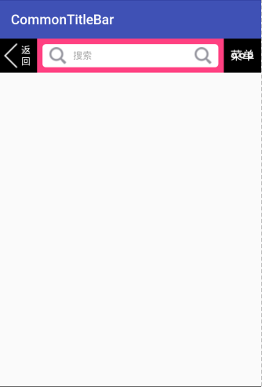
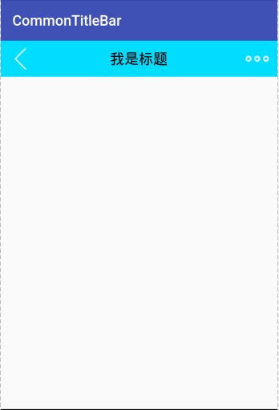

## 一个通用的Android TitleBar，有大量属性可以设置,基本可以满足一般开发需求

## 所有可定义属性

 <!--标题栏高度-->
        <attr name="title_bar_height" format="dimension|reference"/>
        <!--标题栏整体背景-->
        <attr name="title_bar_background" format="color|reference"/>

        <!--左侧View容器是否显示-->
        <attr name="left_view_visibility" format="boolean"/>
        <!--左侧TextView是否显示-->
        <attr name="left_textView_visibility" format="boolean"/>
        <!--左侧ImageView是否显示-->
        <attr name="left_imageView_visibility" format="boolean"/>
        <!--左侧View容器背景色-->
        <attr name="left_view_background" format="color|reference"/>
        <!--返回键文字-->
        <attr name="left_text" format="string|dimension"/>
        <!--返回键TextView左侧图标-->
        <attr name="left_textView_drawable" format="reference"/>
        <!--返回键文字字号-->
        <attr name="left_text_size" format="dimension|reference"/>
        <!--返回键文字颜色-->
        <attr name="left_text_color" format="color|reference"/>
        <!--返回键TextView背景色-->
        <attr name="left_textView_background" format="color|reference"/>

        <!--返回键图标-->
        <attr name="left_image" format="reference"/>

        <!--右侧View容器背景色-->
        <attr name="right_view_background" format="color|reference"/>
        <!--右侧View容器是否显示-->
        <attr name="right_view_visibility" format="boolean"/>
        <!--右侧TextView是否显示-->
        <attr name="right_textView_visibility" format="boolean"/>
        <!--右侧ImageView是否显示-->
        <attr name="right_imageView_visibility" format="boolean"/>
        <!--菜单键文字-->
        <attr name="right_text" format="string|dimension"/>
        <!--菜单键文字字号-->
        <attr name="right_text_size" format="dimension|reference"/>
        <!--菜单键文字颜色-->
        <attr name="right_text_color" format="color|reference"/>
        <!--菜单键TextView背景色-->
        <attr name="right_textView_background" format="color|reference"/>

        <!--菜单键图标-->
        <attr name="right_image" format="reference"/>

        <!--中间View容器背景色-->
        <attr name="middle_view_background" format="color|reference"/>
        <!--title是否显示-->
        <attr name="title_visibility" format="boolean"/>
        <!--搜索框是否显示-->
        <attr name="search_visibility" format="boolean"/>
        <!--标题文字-->
        <attr name="title_text" format="string|reference"/>
        <!--标题字号-->
        <attr name="title_text_size" format="dimension|reference"/>
        <!--标题文字颜色-->
        <attr name="title_text_color" format="color|reference"/>
        <!--标题TextView背景色-->
        <attr name="title_text_background" format="color|reference"/>

        <!--搜索框hint-->
        <attr name="title_search_hint" format="string|reference"/>
        <!--搜索框hint颜色-->
        <attr name="title_search_hint_color" format="color|reference"/>
        <!--搜索框文字-->
        <attr name="title_search_text" format="string|reference"/>
        <!--搜索框padding-->
        <attr name="title_search_paddingLeft" format="dimension|reference"/>
        <attr name="title_search_paddingTop" format="dimension|reference"/>
        <attr name="title_search_paddingRight" format="dimension|reference"/>
        <attr name="title_search_paddingBottom" format="dimension|reference"/>

        <!--搜索框小图标-->
        <attr name="title_search_drawableLeft" format="reference"/>
        <attr name="title_search_drawableRight" format="reference"/>

        <!--搜索框文字颜色-->
        <attr name="title_search_text_color" format="color|reference"/>
        <!--搜索框文字字号-->
        <attr name="title_search_text_size" format="dimension|reference"/>
        <!--搜索框背景-->
        <attr name="title_search_background" format="color|reference"/>
        <!--搜索框文字排版-->
        <attr name="title_search_text_gravity">
            <!--居中-->
            <enum name="center" value="17"/>
            <!--居左-->
            <enum name="left" value="19"/>
            <!--居右-->
            <enum name="right" value="21"/>
        </attr>

 ## sample
     <com.mewlxy.library.CommonTitleBar
             android:id="@+id/title"
             android:layout_width="match_parent"
             android:layout_height="wrap_content"
             app:left_image="@drawable/ic_back"
             app:left_imageView_visibility="false"
             app:left_text="返回"
             app:left_textView_drawable="@drawable/ic_back"
             app:left_textView_background="@android:color/primary_text_light"
             app:left_textView_visibility="true"
             app:left_text_color="@android:color/white"
             app:left_text_size="14sp"
             app:left_view_background="@android:color/transparent"
             app:left_view_visibility="true"
             app:middle_view_background="@color/colorAccent"
             app:right_image="@drawable/ic_menu"
             app:right_imageView_visibility="true"
             app:right_text="菜单"
             app:right_textView_background="@android:color/black"
             app:right_textView_visibility="true"
             app:right_text_color="@android:color/white"
             app:right_text_size="18sp"
             app:right_view_background="@color/colorPrimary"
             app:right_view_visibility="true"
             app:search_visibility="true"
             app:title_bar_background="@android:color/white"
             app:title_bar_height="50dp"
             app:title_search_background="@drawable/bg_title_search"
             app:title_search_drawableLeft="@drawable/icon_search"
             app:title_search_drawableRight="@drawable/icon_search"
             app:title_search_hint="输入要搜索内容"
             app:title_search_hint_color="@android:color/holo_green_light"
             app:title_search_paddingBottom="2dp"
             app:title_search_paddingLeft="5dp"
             app:title_search_paddingRight="5dp"
             app:title_search_paddingTop="2dp"
             app:title_search_text="搜索"
             app:title_search_text_color="@android:color/darker_gray"
             app:title_search_text_gravity="left"
             app:title_search_text_size="14sp"
             app:title_text="我是标题"
             app:title_text_background="@android:color/white"
             app:title_text_color="@android:color/white"
             app:title_text_size="20sp"
             app:title_visibility="false"/>

## 一般使用

    <com.mewlxy.library.CommonTitleBar
        android:id="@+id/title"
        android:layout_width="match_parent"
        android:layout_height="wrap_content"
        app:right_imageView_visibility="true"
        app:title_bar_background="@android:color/holo_blue_bright"
        app:title_text="我是标题"/>
## 效果

## 点击事件
    CommonTitleBar titleBar = (CommonTitleBar) findViewById(R.id.title);
    titleBar.setOnCustomClicklistener(new CommonTitleBar.OnCommonClicklistener()
    {

        @Override
        public void onCustomLeftClick(View view)
        {
            Toast.makeText(getApplicationContext(),"left click",Toast.LENGTH_SHORT).show();
        }

        @Override
        public void onCustomRightClick(View view)
        {
            Toast.makeText(getApplicationContext(),"right click",Toast.LENGTH_SHORT).show();
        }

        @Override
        public void onCustomSearchClick(View view)
        {
            Toast.makeText(getApplicationContext(),"title click",Toast.LENGTH_SHORT).show();
        }
    });

## 加入到项目
#### maven
    <dependency>
      <groupId>com.mewlxy.commontitlebar</groupId>
      <artifactId>CommonTitleBar</artifactId>
      <version>1.0.1</version>
      <type>pom</type>
    </dependency>
#### gradle
    compile 'com.mewlxy.commontitlebar:CommonTitleBar:1.0.1'
#### lvy
    compile 'com.mewlxy.commontitlebar:CommonTitleBar:1.0.1'
    <dependency org='com.mewlxy.commontitlebar' name='CommonTitleBar' rev='1.0.1'>
      <artifact name='CommonTitleBar' ext='pom' ></artifact>
    </dependency>

